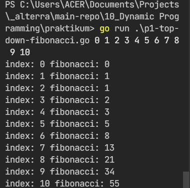
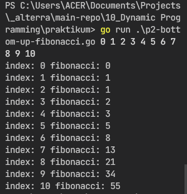

# 10) Dynamic Programming

## Overview

Dalam chapter ini, hal yang didapat antara lain:

1. [Dynamic Programming secara Umum](#general-of-dynamic-programming);
2. [Karakteristik Dynamic Programming](#characteristics);
3. [Metode Dynamic Programming](#methods).

### General of Dynamic Programming

Suatu teknik algoritma untuk menyelesaikan masalah secara optimal dengan cara memecah masalah menjadi lebih sederhana untuk diselesaikan kemudian dari solusi dari sub-masalah tersebut diambil yang paling optimal.

### Characteristics

- Masalah yang bertumpang tindih (overlap)

  Untuk menyelesaikan masalah, DP menumpang-tindihkan masalah yang telah dipecah menjadi bagian-bagian yang lebih sederhana untuk diselesaikan secara bersamaan.

- Memiliki properti substruktur yang optimal

  Ketika menyelesaikan masalah, DP menggunakan properti yang lebih sederhana dari objek yang tumpang tindih untuk diselesaikan terlebih dahulu.

### Methods

- Top-Down with Memoization

  Menyelesaikan masalah secara rekursif untuk menyelesaikan masalah utama dan disederhanakan untuk dikerjakan terlebih dahulu. Hasil dari sub-problem akan disimpan sementara sehingga kita tidak perlu menyelesaikan masalah yang sama untuk berulang kali.

- Bottom-Up with Tabulation

  Kebalikan dari top-down dan menghindari terjadinya rekursi. Masalah akan diselesaikan dalam tabel n-dimensi, kemudian solusi dari sub-masalah teratas akan dijadikan solusi final.

## Tasks

### P1 - Fibonacci with Top-Down

- solution: [p1-top-down-fibonacci](praktikum/p1-top-down-fibonacci.go)
- command to run:
  
  ```bash
    // case 1 .. 11
    go run ./praktikum/p1-top-down-fibonacci.go 0 1 2 3 4 5 6 7 8 9 10
  ```

- screenshot: 

### P1 - Fibonacci with Bottom-Up

- solution: [p2-bottom-up-fibonacci](praktikum/p2-bottom-up-fibonacci.go)
- command to run:
  
  ```bash
    // case 1 .. 11
    go run ./praktikum/p2-bottom-up-fibonacci.go 0 1 2 3 4 5 6 7 8 9 10
  ```

- screenshot: 
