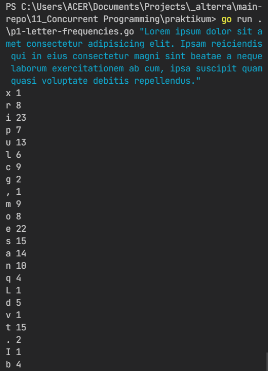

# 11) Concurrent Programming

## Tasks

### P1 - Count Letter Concurrently

- solution [p1-letter-frequencies.go](praktikum/p1-letter-frequencies.go)
- command to run:

  ```bash
    go run .\p1-letter-frequencies.go "Lorem ipsum dolor sit amet consectetur adipisicing elit. Ipsam reiciendis qui in eius consectetur magni sint beatae a neque laborum exercitationem ab cum, ipsa suscipit quam quasi voluptate debitis repellendus."
  ```

- screenshot: 
