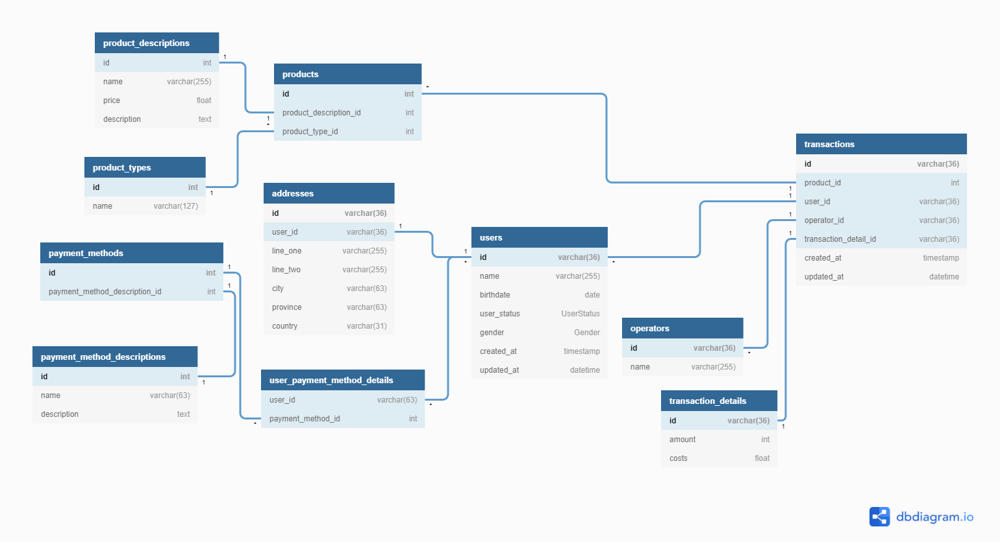

# 13) Database Schemas - DDL - DML

## Tasks

### P1 - ERD

- ERD Urls: [dbdiagram.io scheme](https://dbdiagram.io/d/623067c2a709d66deaabbd41);
- Output:
  

### P2 - MySQL Implementation

- SQLs: [MySQL dialect db implementation](./praktikum/p2-database-implementations.sql)
