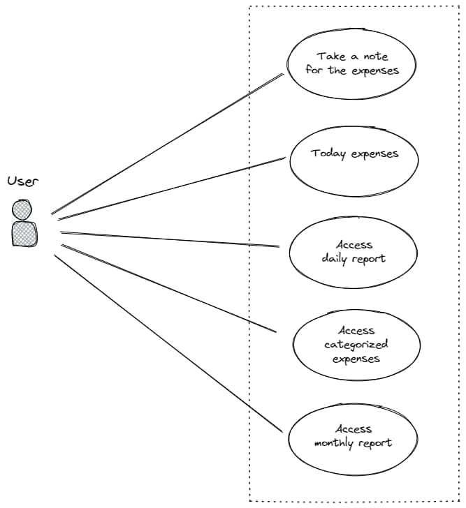

# The Tasks

## User Story

### As an user

- I want to open my expense apps,  
  so that, I can view expenses summary today;
- I want to input my expense name and my amount of money that I spent,  
  so that, I can log my expenses today;
- I want to open history of my expenses,  
  so that, I can get the summary of my expenses day per day;
- I want to categorize my spendings,  
  so that, I can track which spendings had consumes much more moneys;
- I want to open monthly history of my expenses,  
  so that I can track which one most I spent my money for on selected month.
<!-- - I want to set daily budget,
  so that I can limit spendings on these day. -->
<!-- - I want to open the app settings,  
  so that I can change my login password; -->

## Related Tasks

### Entity Relatonship Diagram

dbdiagram: <https://dbdiagram.io/d/623ab4d7bed6183873e08ebc>

### Use Case Diagram

