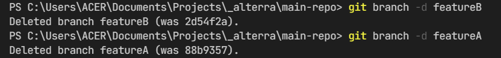

# 2) Version Control and Branch Management 

## Overview
Dalam materi ini, dapat mendalami materi: 
1. [Version control](#version-control);
2. [Set Up Git](#set-up-git);
3. [Operasi dasar Git](#operasi-dasar-git);
4. [Branching](#branching); dan
5. [Collaboration workflow](#workflow-collaboration).

### Version Control
Version control adalah suat alat yang digunakan untuk mengelola perubahan pada setiap file dalam suatu project. Perubahan suatu file diperlukan untuk dapat menyempurnakan project tersebut. 

Version control system dibagi menjadi tiga macam, yaitu: 
  - Single user, terdiri atas SCCS dan RCS;
  - Centralized, berfokus pada file based dan struktur folder secara sentral;
  - Distributed, perubahan file dapat dilakukan secara terdistribusi dan dapat disatukan kembali, salah satunya git.

### Set Up Git 
#### Instalasi
Hal yang pertama kali dapat dilakukan untuk menggunakan git adalah dengan menginstallnya. Langkah instalasi dapat mengikuti situs resmi git di [git-scm](https://git-scm.org).

#### Global (Local) Configuration
Konfigurasi lokal (yang wajib) dilakukan dengan menambahkan nama author dan email author yang tentunya telah terdaftar di git server ke `git config`.
<!-- ```bash
# Konfigurasi author credentials
$ git config --global user.name "Hamdan Yuwafi"
$ git config --global user.email "yuwafi.hamdan365@gmail.com"

# Cek konfigurasi
$ git config --list
``` -->

#### Inisialisasi Repositori
Inisialisasi repositori dapat dilakukan manual dengan `git init` kemudian menambahkan alamat upstream repository dengan `git remote add origin <repo-url>`. Selain itu, dapat juga menggunakan `git clone` dan console diarahkan ke direktori clone project yang tergenerate.

<!-- ```bash
# Inisialisasi dengan git init 
$ git init
# Menambah upstream repositori
$ git remote add origin git@github.com:username/repo-name.git
# Publish branch master ke upstream
$ git push -u origin master

# ------------------------
# Inisialisasi dengan clone repo
$ git clone git@github.com:username/repo-name.git
$ cd repo-name

# Clone + custom folder name
$ git clone git@github.com:username/repo-name.git repo-utama
$ cd repo-utama
``` -->

### Operasi Dasar Git
#### Menyimpan perubahan file
Terdapat tiga tingkatan perubahan file, tingkatan file terawal hingga terakhir yaitu: WIP (Work In Progress) file, staging file dan commited file. 

WIP file dapat dinaikkan ke staging dengan menggunakan `git add` secara spesifik (dengan nama file) atau keseluruhan file WIP (dengan tanda titik `.`). 

File-file dalam tingkatan staging merupakan file-file yang tuntas dalam pengerjaan dalam satu cycle commit dan siap dinaikkan ke commited files. Proses menaikkan ke commited files dapat dilakukan dengan `git commit` dengan menyertakan ringkasan perubahan secara singkat, jelas dan padat.

#### Melacak dan menahan (stash) perubahan
Untuk melacak perubahan antara dua commit atau pada dua branch dapat dilakukan dengan `git diff`. 

Ketika perubahan file belum selesai dan harus berpindah ke branch lain, perubahan dapat ditahan dengan menaikkan ke staging dengan `git add .` dan stash dengan pesan yang deskriptif `git stash push -m "some descriptive message"`.

#### Inspeksi Perubahan
Dapat menggunakan `git log` dan berpindah ke kondisi commit ber-nomor hash atau branch lain dengan `git checkout <7-digit-hash>`. Dan, setiap perubahan dapat diundo dengan `git reset`.

#### Sinkronisasi Upstream
Untuk memeriksa apakah ada perubahan di upstream, dapa dilakukan dengan `git fetch`. Untuk mengunduhnya, dapat dilakukan dengan `git pull`. Dan, jalan upload perubahan dengan `git push`.

### Branching
#### Manajemen Branch
Terdapat dua bagian utama, branch lokal dan upstream. Modifikasi terhadap branch lokal dapat dilakukan dengan operasi `git branch`, untuk me-rename dan menghapusnya. Namun untuk modifikasi branch upstream dapat menggunakan `git push`, seperti contoh penghapusan `git push -d origin branch-name`.

#### Merge Branch
Jika terdapat dua branch dan ingin disatukan maka cukup dengan pergi ke branch tujuan merge dan lakukan `git merge branch-asal-merge`.

Terkadang ada conflict dalam proses merge branch, disebabkan terdapat file yang sama-sama terupdate dengan perubahan yang berbeda. Proses merge akan tertahan dan menunggu untuk disolve.

#### Pull Request 
Pull request akan meminta "project master" untuk memeriksa perubahan sebelum di merge ke branch utama. Proses ini sering dilakukan untuk project kolaboratif dan hanya dapat dilakukan di git server.

### Workflow Collaboration
Dalam suatu project, ada yang disebut branch utama (master, main, dlsb.). Namun, project perlu dikembangkan. Dalam suatu siklus development, metilah terdapat suatu branch yang menghandle satu siklus tersebut, maka terbentuklah branch development (dev, development, dlsb.). 

Dalam penambahan satu fitur, baiknya membuat branch baru dari branch `dev`, dan dimerge ke branch `dev` kembali. Jika suatu siklus selesai, maka branch `dev` akan kembali dimerge ke branch `master`.


## Tasks 

1. Buat repository di github.com
   
    

2. Clone dengan git clone
   ```bash 
   $ git clone git@github.com:thisham/go_hamdan-yuwafi-mastu-wijaya.git main-repo
   ```
   
3. Pindah ke branch `dev`
    
    

4. Push ke upstream
    
    

5. Pindah ke `featureA` dari `dev` dan push ke upstream
    
    

6. Buat perubahan di branch featureA, commit dan push ke upstream
    
    

7. Pindah ke branch `dev`
    
    

8. Buat branch `featureB` dari `dev` dan push ke upstream
    
    

9.  Buat perubahan di branch featureB dan commit
    
    

10. Merge ke branch `dev` dari `featureA`
    
    

11. Merge ke branch `dev` dari `featureB`, dan muncul conflict
    
    

12. Resolve conflict 
    
    
    
    

13. Push ke staging dan commit hasil resolve
    
    

14. Push ke upstream untuk branch `dev`
    
    
    
15. Merge branch ke `master` dari `dev`
    
    

16. Hapus branch-branch lokal dan di upstream yang tidak terpakai
    
    
    
    

### Unusual Cases
Terdapat perubahan terhadap file, namun masih belum siap untuk di-commit. Akan tetapi karena ada suatu hal, terpaksa harus berpindah branch. Maka, dapat menggunakan stash. Misalkan sebagai berikut:
1. Buat perubahan, naikkan ke staging dan masukkan ke stash
   
   
2. Ketika selesai apply kembali berubahan dan hapus stash
   
   
