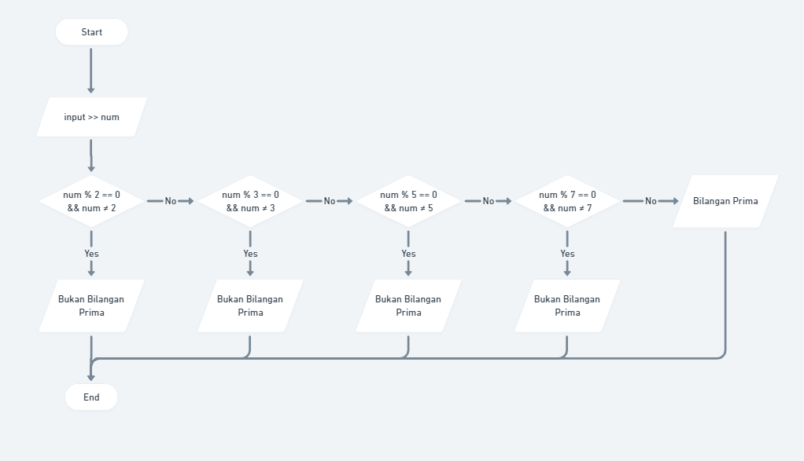
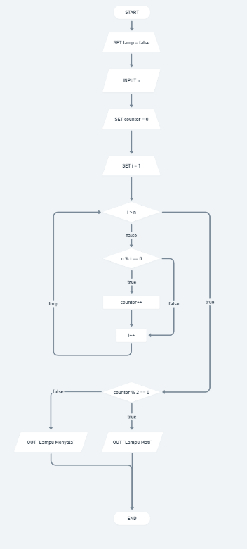
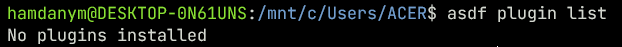
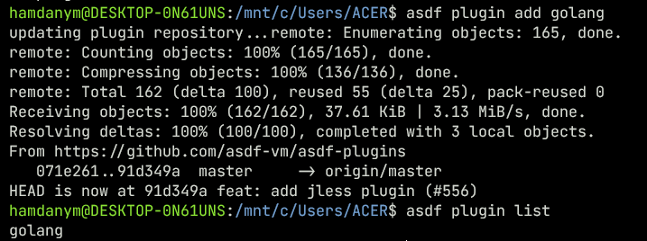
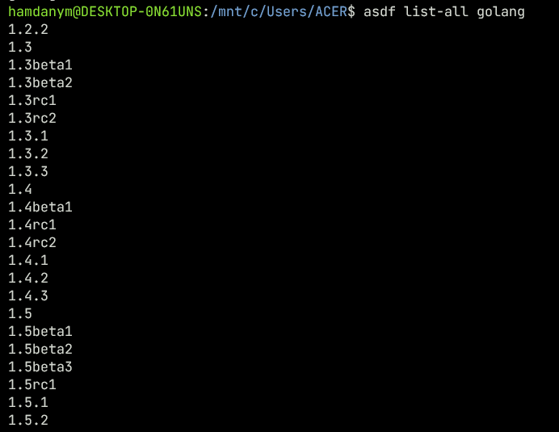
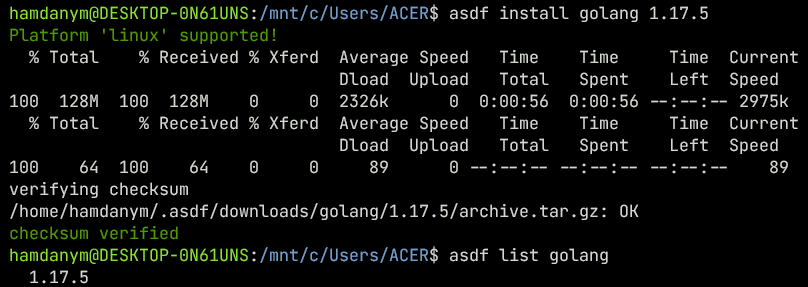
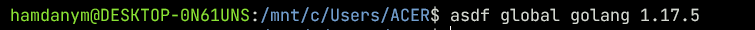
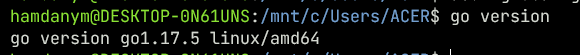

# 3) Introduction to Algorithm and Golang

## Overview
Dalam materi ini, saya mendalami materi tentang:
1. [Algoritma dan Karakteristiknya](#algoritma-dan-karakteristiknya);
2. [Algoritma Dasar](#algoritma-dasar);
3. [Pseudocode](#pseudocode);
4. [Flowchart](#flowchart).

### Algoritma dan Karakteristiknya
Algoritma adalah suatu prosedur komputasi yang didefinisikan secara ringkas dan jelas, memproses input hingga menjadi output. Karakteristiknya adalah memiliki awal dan akhir, terinstruksi secara sistematis dan definitif, serta dijelaskan secara efektif dan efisien.

### Algoritma Dasar
Di antara algoritma dasar antara lain:
- sequential, perpindahan antara satu proses ke proses lain;
- branching, perpindahan dari proses asal ke proses yang memerlukan satu pengkondisian, melambangkan pernyataan jika maka secara langsung;
- looping, perpindahan antar proses dengan pengkondisian seperti branching, namun bila belum terpenuhi prosedur akan diulangi.

### Pseudocode
Pseudocode adalah algoritma yang ditulis menggunakan bahasa yang "mendekati" bahasa pemrograman, namun masih dapat dimengerti dan tak terikat oleh bahasa pemrograman apapun.

### Flowchart
Flowchart merupakan penggambaran algoritma dengan simbol-simbol dengan urutan dan dijelaskan secara mendetail.
## Tasks
### Algoritma penentuan bilangan prima

Whimsical Flowchart: https://whimsical.com/alterra-prima-YV4fcs31AAoLLF4Fstc6tY

### Algoritma lampu dan tombol

Whimsical Flowchart: https://whimsical.com/alterra-lamp-Mecwb2j2oh4vuNDZfChbKj

### Instalasi Golang (via ASDF plugins WSL Ubuntu 18.04)
1. Cek plugin terpasang di ASDF dengan `asdf plugin list`;

    

2. Pasang plugin golang di ASDF dengan `asdf add golang` dan cek lagi apakah plugin terpasang dengan baik;

    

3. Cek versi golang yang tersedia di ASDF dengan `asdf list-all golang`;

    

4. Unduh paket instalasi golang dengan `asdf install golang no.mor.versi` dan cek paket golang di ASDF dengan `asdf list golang`;

    

5. Set up global version untuk command `go` dengan `asdf global golang no.mor.versi`;

    

6. Cek instalasi golang dengan `go version`.

    
