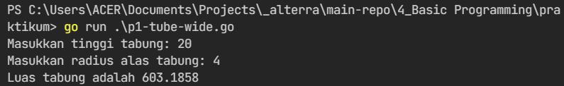
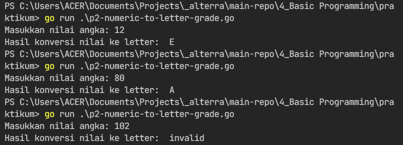
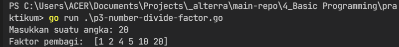
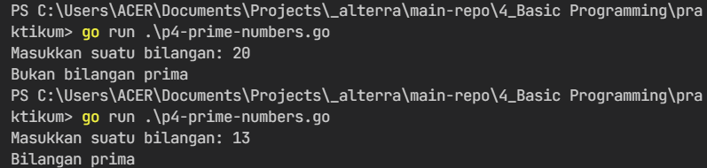
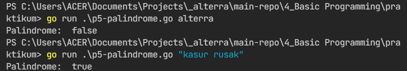
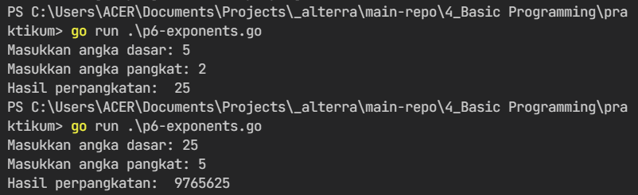
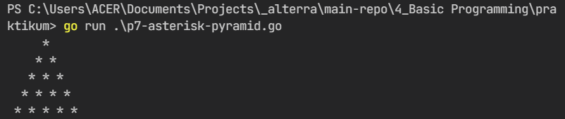
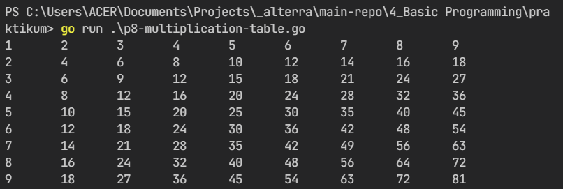

# 4) Basic Programming

## Overview
Dalam section ini, dapat dipelajari:
1. [Go Module](#go-module);
2. ["fmt" Package](#fmt-module);
3. [Dasar Pemrograman](#dasar-pemrograman);

### Go Module
Go module adalah suatu koleksi dari paket-paket dependensi golang yang terkoneksi dengan go.mod di file root. File go.mod mendefinisikan deoendensi yang dipakai dan akan diambil dari direktori go root.

### "fmt" Module
Module "fmt" adalah salah satu module yang disediakan golang secara default. Module ini digunakan untuk interaksi input dan output data antara user dan sistem

### Dasar Pemrograman
Dalam pemrograman, terdapat dasar-dasar yang harus diketahui. Termasuk tentang bagaimana menyimpan data dalam variabel, tipe variabel itu sendiri dan karakteristiknya. 

Kadangkala, suatu prosedur harus dijalankan dalam kondisi tertentu, maka diadakanlah branching untuk memenuhinya. Namun pada saat suatu kondisi tersebut harus memberikan instruksi yang berulang, maka looping dapat digunakan untuk mengatasinya.

## Task
### Problem 1 - Luas Tabung
- Source code: [P1 - Tube Wide](./praktikum/p1-tube-wide.go)
- Command to run: `go run .\p1-tube-wide.go`
- Result: 

  

### Problem 2 - Konversi ke Nilai Angka
- Source code: [P2 - Numeric to Letter Grade](./praktikum/p2-numeric-to-letter-grade.go)
- Command to run: `go run .\p2-numeric-to-letter-grade.go`
- Result: 

  

### Problem 3 - Faktor Pembagi Angka
- Source code: [P3 - Number Divide Factor](./praktikum/p3-number-divide-factor.go)
- Command to run: `go run .\p3-number-divide-factor.go`
- Result: 

  

### Problem 4 - Bilangan Prima
- Source code: [P4 - Prime Number](./praktikum/p4-prime-numbers.go)
- Command to run: `go run .\p4-prime-numbers.go`
- Result: 

  

### Problem 5 - Palindrome
- Source code: [P5 - Palindrome](./praktikum/p5-palindrome.go)
- Command to run: `go run .\p5-palindrome.go "text will be checked as palindrome"`
- Result: 

  

### Problem 6 - Exponents
- Source code: [P6 - Exponents](./praktikum/p6-exponents.go)
- Command to run: `go run .\p6-exponents.go`
- Result: 

  

### Problem 7 - Play with Asterisk
- Source code: [P7 - Asterisk Pyramid](./praktikum/p7-asterisk-pyramid.go)
- Command to run: `go run .\p7-asterisk-pyramid.go`
- Result: 

  

### Problem 8 - Multiplication Table
- Source code: [P8 - Multiplication Table](./praktikum/p8-multiplication-table.go)
- Command to run: `go run .\p8-multiplication-table.go`
- Result: 

  
