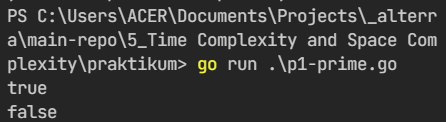
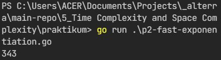
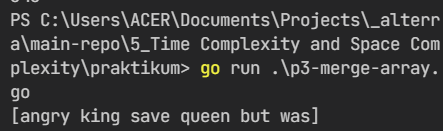
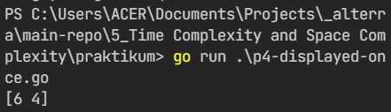
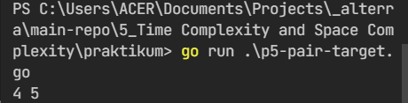

# 5) Time Complexity and Space Complexity

## Overview

Dalam chapter ini, dapat dipelajari:

1. [Dominant Operation](#dominant-operation);
2. [Time Complexity](#time-complexity);
3. [Space Complexity](#space-complexity).

### Dominant Operation

Dominant operation adalah operasi utama yang dijalankan dalam suatu algoritma.

### Time Complexity

Time complexity merupakan estimasi rerata waktu terhadap algoritma yang dijalankan. Kompleksitas waktu ini ditentukan berdasarkan **kedalaman looping** dalam suatu program dalam menjalankan operasi primitif (single addition, multiplications, assignments). Namun dalam setiap blok kompleks looping, terdapat satu operasi dominan yang dijalankan.

### Space Complexity

Space complexity merupakan kompleksitas ruang dari suatu algoritma. Kompleksitas ini ditentukan berdasarkan **banyaknya variabel yang terbentuk** dalam suatu fungsi atau proses.

## Tasks

### Problem 1 - Fast Prime Check

- Source code: [P1 - Fast Prime Check](praktikum/p1-prime.go)
- Description: Metode ini menggunakan pengecekan akar kuadrat untuk basis perulangannya.
- Output:

  

### Problem 2 - Fast Exponentiation

- Source code: [P2 - Fast Exponentiation](praktikum/p2-fast-exponentiation.go)
- Description: Metode ini menggunakan algoritma perulangan yang berbentuk rekursif.
- Output:

  

### Problem 3 - Merge Array without Duplicates

- Source code: [P3 - Merge Array without Duplicates](praktikum/p3-merge-array.go)
- Output:

  

### Problem 4 - Displayed Once Characters

- Source code: [P4 - Displayed Once Characters](praktikum/p4-displayed-once.go)
- Output:

  

### Problem 5 - Pairs Sum Target

- Source code: [P5 - Pairs Sum Target](praktikum/p5-pair-target.go)
- Output:

  

