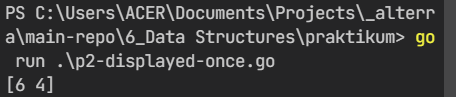

# 6) Data Structures

## Overview

Dalam chapter ini, dapat dipelajari:

1. [Arrays](#array);
2. [Mapping Data Structures](#mapping-data-structures);
3. [Functions](#functions).

### Arrays

Array adalah sekumpulan data sejenis yang ditampung dalam satu variabel. Array memiliki operasi dasar, yaitu copy value dan append. Copy value untuk menyalin isi array ke variabel lain, sedangkan append untuk menambah value di dalam variabel array. Selain itu, suatu variabel array dapat dibuat dengan slice sebagian value variabel array asal.

### Mapping Data Structures

Tipe map merupakan sebuah struktur data yang digunakan untuk menyimpan data dalam bentuk pasangan key dan value, dengan sifat bahwa key selalu unik.

### Functions

Fungsi merupakan sekumpulan prosedur yang dapat dipanggil menggunakan nama fungsinya. Fungsi memiliki nilai balik dan variabel parameter untuk menjalankan prosedur-prosedur yang dikerjakan dalam fungsi tersebut.

## Tasks

### Problem 1 - Merge Array without Duplicates

- Source code: [P1 - Merge Array without Duplicates](praktikum/p1-merge-array.go)
- Output:

  

### Problem 2 - Displayed Once Characters

- Source code: [P2 - Displayed Once Characters](praktikum/p2-displayed-once.go)
- Output:

  

### Problem 3 - Pairs Sum Target

- Source code: [P3 - Pairs Sum Target](praktikum/p3-pair-target.go)
- Output:

  
