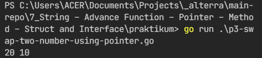

# 7) String – Advance Function – Pointer – Method – Struct and Interface

## Overview

Dalam chapter ini, dapat dipelajari:

1. [String Operations](#string-operations);
2. [Function and Methods](#function-and-methods);
3. [Pointer, Struct and Interface](#pointer-struct-and-interface);
4. [Packages](#packages)
5. [Error Handling](#error-handling).

### String Operations

String operation merupakan operasi-operasi yang berkaitan dengan string. Termasuk slicing, concatenating, replace dan pengukuran panjang string.

### Function and Methods

Fungsi dan method memiliki beberapa opsi untuk deklarasi dan eksekusinya. Masing-masing metode deklarasi memiliki case dalam setiap penggunaannya.

Variadic function memiliki parameter berbentuk slice temporary yang mengizinkan untuk passing lebih dari satu argumen dalam pemanggilan fungsinya. Untuk menggunakan parameter tersebut pengaksesannya seperti cara untuk mengakses slice.

Anonymus function merupakan fungsi yang tidak bernama, namun dapat dipanggil secara langsung, diberi parameter dan disimpan di variabel maupun di const.

Closure merupakan fungsi anonim yang dapat memiliki referensi variabel di luar fungsi tersebut.

Defer merupakan fungsi anonim yang akan diakses secara otomatis (jika dipanggil) ketika prosedur utama di fungsi induk dijalankan

### Pointer, Struct and Interface

Struct merupakan teknik pendefinisian tipe data baru yang berisi berbagai macam tipe data primitif. Sedangkan, untuk memeberikan tanda kepada suatu objek bahwa objek tersebut memiliki method apa saja. Dari struct dan interface tersebut dapat dibentuk dan di-instansiasikan ke dalam suatu variabel. Dan, setiap variabel memiliki alamat alokasi dalam memori. Alamat alokasi tersebut dapat disimpan di dalam pointer.

### Packages

Packages adalah kumpulan kode yang accessible di code lain selain di sub-folder / paket tersebut.

### Error Handling

Panic error untuk menghentikan paksa blok kode yang sedang dieksekusi. Kemudian, golang akan memanggil defer untuk me-recover error yaNg sedang dialami.

## Tasks

### Problem 1 - Common Substring

- Source code: [P1 - Common Substring](praktikum/p1-common-substring.go)
- Output:

  

### Problem 2 - Caesar Cipher

- Source code: [P2 - Caesar Cipher](praktikum/p2-caesar-cipher.go)
- Output:

  

### Problem 3 - Swap Two Number using Pointer

- Source code: [P3 - Swap Two Number using Pointer](praktikum/p3-swap-two-number-using-pointer.go)
- Output:

  

### Problem 4 - Min Max Using Pointer

- Source code: [P4 - Min Max Using Pointer](praktikum/p4-min-max-using-pointer.go)
- Output:

  

### Problem 5 - Student Score

- Source code: [P5 - Student Score](praktikum/p5-student-score.go)
- Output:

  

### Problem 6 - Substitution Cipher

- Source code: [P6 - Substitution Cipher](praktikum/p6-substitution-cipher.go)
- Output:

  
