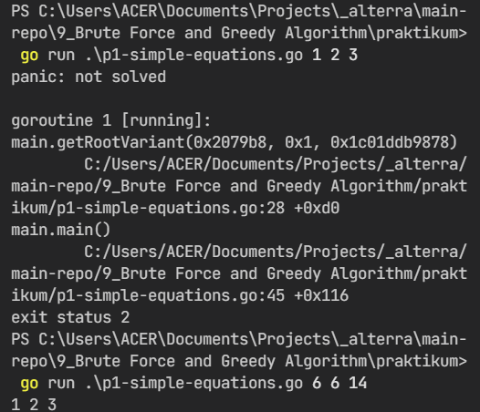
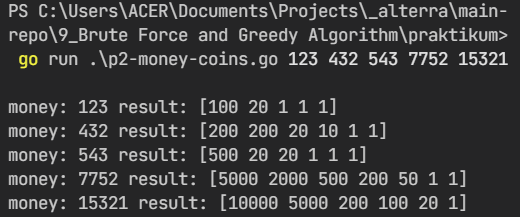
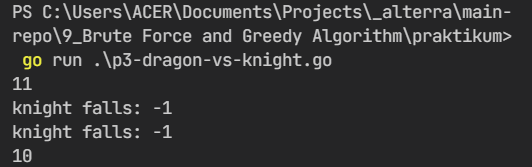
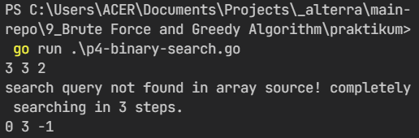

# 9) Brute Force, Greedy and Divide and Conquer

## Overview

Hal yang dapat dipelajari di chapter ini adalah:

1. [Brute Force Algorithm];
2. [Greedy Algorithm];
3. [Divide and Conquer Algorithm].

### Brute Force

Brute force merupakan algoritma yang dapat menyelesaikan masalah dengan cara mencoba satu-persatu solusi secara berurutan dan akan berhenti ketika satu solusi tepat ditemukan. Kecepatan pencarian solusi dari algoritma brute force ini sangat bergantung dari kerumitan problem yang dihadapi. Semakin rumit permasalahan, semakin lama waktu penyelesaian dari algoritma ini.

### Greedy Algorithm

Greedy merupakan salah satu algoritma untuk pemecahan masalah dengan mencari solusi paling optimal pada setiap langkah untuk dijadikan solusi finalnya.

### Divide and Conquer Algorithm

Divide and conquer merupakan algoritma yang dalam pencarian solusinya memecah masalah menjadi bagian-bagian terkecil, kemudian bagian kecil-kecil tersebut akan diselesaikan terlebih dahulu untuk mencapai solusi final.

## Tasks

### P1 - Simple Equations

- solution: [p1-simple-equation](praktikum/p1-simple-equations.go)
- command to run:
  
  ```bash
    // case 1
    go run ./praktikum/p1-simple-equations.go 6 6 14
    
    // case 2
    go run ./praktikum/p1-simple-equations.go 1 2 3
  ```

- screenshot: 

### P2 - Money Coins

- solution: [p2-money-coins](praktikum/p2-money-coins.go)
- command to run:
  
  ```bash
    // case 1 to 5
    go run ./praktikum/p2-money-coins.go 123 432 543 7752 15321
  ```

- screenshot: 

### P3 - Dragon of Loofwater

- solution: [p3-dragon-vs-knight](praktikum/p3-dragon-vs-knight.go)
- command to run:
  
  ```bash
    // cases included
    go run ./praktikum/p3-dragon-vs-knight.go
  ```

- screenshot: 

### P4 - Binary Search

- solution: [p4-binary-search](praktikum/p4-binary-search.go)
- command to run:
  
  ```bash
    // cases included
    go run ./praktikum/p4-binary-search.go
  ```

- screenshot: 
